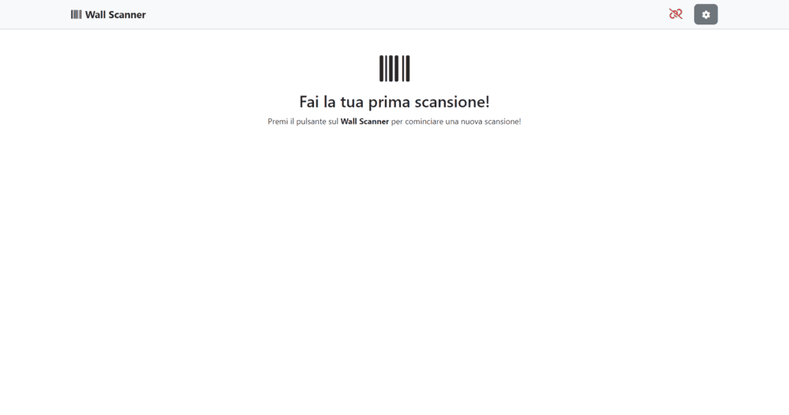
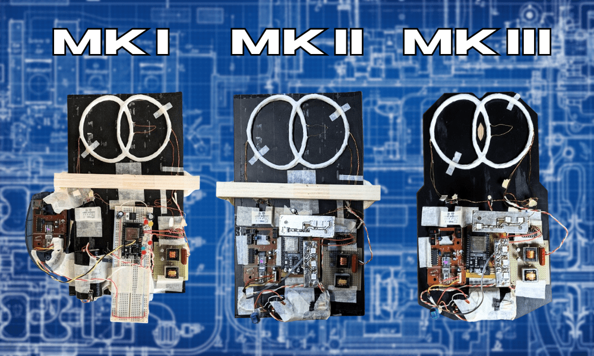

# 📡 Wall-Scanner - Rilevatore Portatile di Metalli nelle Murature

---

## 🎯 Che Cos'è Wall-Scanner?

Wall-Scanner è un dispositivo portatile basato su ESP32 progettato per mappare la presenza di elementi metallici all'interno di pareti e superfici, visualizzando una heatmap in tempo reale tramite un'interfaccia web accessibile da smartphone o PC 🌐📱🔍.

### 🌟 Punti Chiave

- 🧲 **Rilevazione metalli**: Individua tubi, tondini e piccole strutture metalliche nelle pareti
- 📡 **Connettività Wi-Fi**: Aggiornamenti in tempo reale via WebSocket per visualizzazione live della heatmap
- 🔋 **Design portatile**: Dispositivo alimentato a batteria, leggero con interfaccia web intuitiva
- 🎯 **Discriminazione materiali**: Differenziazione approssimativa tra metalli ferromagnetici e non ferromagnetici tramite codifica a colori
- 📊 **Imaging elettromagnetico**: Genera mappe elettromagnetiche in tempo reale delle superfici scansionate
- 📱 **Accesso multipiattaforma**: Compatibile con smartphone, tablet e PC
- ⚡ **Calibrazione facile**: Configurazione e processo di scansione semplici per utenti non tecnici

---

## 📸 Interfaccia e Foto

Screenshot e demo della web UI e del prototipo:

### 📱 Interfaccia Web Principale

### ⚙️ Settaggi Disponibili

### 📦 Prodotto Finale

### 🔄 Evoluzione del Prototipo

### 🔍 Esempio di Scansione

---

## 🛠️ Il Progetto Nel Dettaglio

Questo progetto presenta lo sviluppo di un **dispositivo innovativo 🆕 per la rilevazione di strutture metalliche 🧲 all'interno di murature edili**. Il dispositivo permette di scansionare l'area di interesse e di ottenere un'**immagine elettromagnetica 📊** della parete, evidenziando la presenza e la posizione di eventuali **elementi metallici 🔍**.

Il prototipo è stato progettato e realizzato interamente 🔧, ed è in grado di collegarsi tramite **Wi-Fi 📡** a dispositivi esterni come **smartphone 📱** o **PC portatili 💻**. Mentre il dispositivo viene spostato sull'area di interesse, viene creata un'immagine della scansione in tempo reale ⏱️. Il dispositivo è **portatile 🔋** e **leggero ⚖️**, alimentato da un **pacco batteria interno 🔋**, e non necessita di fili esterni 🔌. Ha un'**interfaccia molto semplice 😊** ed intuitiva da utilizzare, anche per personale non tecnico 👷‍♂️, ed è compatibile con qualsiasi dispositivo capace di visualizzare una pagina web 🌐.

Il dispositivo è pensato per tracciare **tubature idrauliche in ferro 🔩**, **tubature in rame 🟫** per liquidi refrigeranti, **tondini per cemento armato 🏗️** e **altre strutture metalliche** di modeste dimensioni 📏. È in grado di discriminare tra metalli **ferromagnetici 🧲** e **non ferromagnetici 🔩**, utilizzando colori diversi per una visualizzazione più intuitiva 🎨.

Questo lo rende estremamente utile per tracciare la presenza di **tubature 🔧** per installare **chiodi 📌**, **perni di sostegno 🛠️**, **strutture portanti 🏗️** e **appendini 🪝**, sia per un utilizzo personale 🏠 che per una clientela privata 🏢. Può anche essere utilizzato da professionisti 👨‍🔧 per rilevare installazioni non documentate 📋, ottenere una chiara idea della tratta di vecchie **tubature di riscaldamento** in rame 🟫, o pianificare nuove linee elettriche ⚡ in **ristrutturazioni 🏠**.

Durante lo sviluppo del progetto, i progressi e i successi sono stati documentati 📝 e sono riassunti in questo repository 🗂️.

---

## Tecnologie 💡

### 🏗️ Architettura Del Progetto

Wall-Scanner è composto da due parti principali:

- 📡 Il firmware sull'ESP32 (che gestisce bobina, letture temporali, mouse PS2 per tracking e un server web statico con WebSocket)
- 🌐 La web‑UI (nella cartella `data`) che riceve i dati via WebSocket e mostra la heatmap in tempo reale

Il dispositivo effettua una tara iniziale, acquisisce misure durante la scansione muovendosi sulla parete e invia i dati al client connesso per la visualizzazione 🔁.

### 💡 Tecnologie e Librerie

Ecco una lista delle tecnologie utilizzate in questo progetto:

#### Frontend

- 🌐 HTML/CSS/JavaScript
- 🎨 Bootstrap (UI)
- 🔗 WebSocket (comunicazione in tempo reale)

#### Dispositivo/Firmware

- 📡 ESP32
- 💾 LittleFS (Filesystem per la web UI)
- 🖱️ PS2MouseHandler (Tracking movimento)
- 🌐 ESPAsyncWebServer/AsyncWebSocket

---

## 📋 Istruzioni Per l'Installazione

### 🔧 Prerequisiti

- 🛠️ PlatformIO (o ambiente Arduino compatibile)
- 📡 ESP32
- 💾 Tool per caricare il filesystem (PlatformIO: Build Filesystem Image, Upload Filesystem Image)

### 📦 Installazione

Per configurare il Wall-Scanner puoi seguire questi passaggi:
1. 🔌 Collega tutto l'hardware necessario all'ESP32.
2. 📥 Scarica il codice sorgente dal repository.
3. ⚙️ Verifica che il pinout dell'ESP sia corretto. Se necessario, modifica i valori dei pin per adattarli alla tua configurazione.
4. 🔗 Collega l'ESP al PC tramite USB.
5. 💾 Utilizza PlatformIO per scrivere la cartella `data` sulla memoria flash dell'ESP (`Build Filesystem Image`, poi `Upload Filesystem Image`).
6. 🚀 Utilizza PlatformIO per caricare il codice sorgente sull'ESP.
7. 🎉 Goditi il Wall-Scanner! ❤️

---

## ✅ Funzionalità principali

- ⚙️ Calibrazione automatica della bobina
- 🖱️ Acquisizione della posizione tramite mouse PS2 (tracking)
- 📊 Generazione di una heatmap in tempo reale inviata via WebSocket
- 💾 Salvataggio temporaneo dei dati di scansione in una stringa CSV per download/analisi
- 🔊 Segnalazione tramite LED e beeper per stato, errori e conferme

---

## 📋 Note Importanti

- ⚙️ Il dispositivo esegue una fase di taratura iniziale (Fi0) prima della scansione.
- 🔄 Durante la scansione muovi il dispositivo su tutta l'area interessata; la risoluzione di scansione è configurabile (variabile `NCM` nelle preferenze).
- 📁 La cartella `data` contiene la web UI: modifiche e miglioramenti alla UI possono essere fatti lì e ricaricati con l'Upload Filesystem Image.

---

## 📄 License

Questo progetto è distribuito sotto la **Licenza MIT** - consulta il file [LICENSE](LICENSE) per i dettagli.

---

## 🙏 Ringraziamenti

- 🎨 **Bootstrap** per il supporto nello styling dell'interfaccia web
- 📊 **Librerie di visualizzazione** (per esempio charting e utilità JS) che rendono possibile la visualizzazione della heatmap e delle metriche
- 🤖 **Autori delle librerie open-source** utilizzate nel firmware: `ESPAsyncWebServer`, `AsyncWebSocket`, `PS2MouseHandler`, `LittleFS` e altre