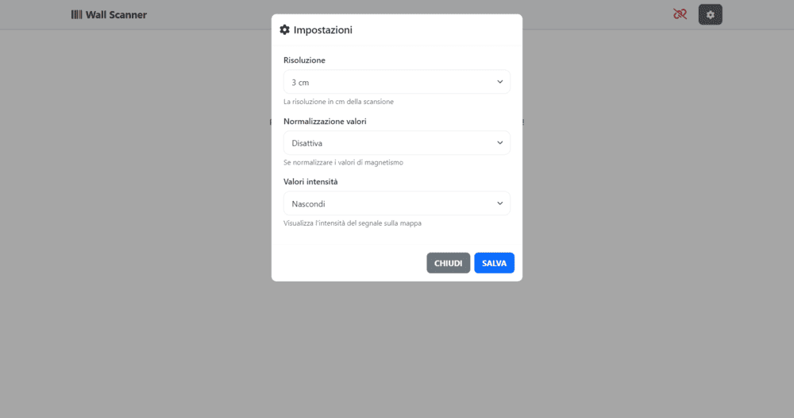

# Wall-Scanner 📡

Dispositivo basato sul microcontrollore `ESP32` in grado di analizzare muri e superfici per individuare e visualizzare la presenza di elementi metallici.

# Il Progetto 🛠️

Questo progetto presenta lo sviluppo di un **dispositivo innovativo per la rilevazione di strutture metalliche all'interno di murature edili**. Il dispositivo permette di scansionare l'area di interesse e di ottenere un'**immagine elettromagnetica** della parete, evidenziando la presenza e la posizione di eventuali **elementi metallici**.

Il prototipo è stato progettato e realizzato interamente, ed è in grado di collegarsi tramite **Wi-Fi** a dispositivi esterni come **smartphone** o **PC portatili**. Mentre il dispositivo viene spostato sull'area di interesse, viene creata un'immagine della scansione in tempo reale. Il dispositivo è **portatile** e **leggero**, alimentato da un **pacco batteria interno**, e non necessita di fili esterni. Ha un'**interfaccia molto semplice** ed intuitiva da utilizzare, anche per personale non tecnico, ed è compatibile con qualsiasi dispositivo capace di visualizzare una pagina web.

Il dispositivo è pensato per tracciare **tubature idrauliche in ferro**, **tubature in rame** per liquidi refrigeranti, **tondini per cemento armato** e **altre strutture metalliche** di modeste dimensioni. È in grado di discriminare tra metalli **ferromagnetici** e **non ferromagnetici**, utilizzando colori diversi per una visualizzazione più intuitiva.

Questo lo rende estremamente utile per tracciare la presenza di **tubature** per installare **chiodi**, **perni di sostegno**, **strutture portanti** e **appendini**, sia per un utilizzo personale che per una clientela privata. Può anche essere utilizzato da professionisti per rilevare installazioni non documentate, ottenere una chiara idea della tratta di vecchie **tubature di riscaldamento** in rame, o pianificare nuove linee elettriche in **ristrutturazioni**.

Durante lo sviluppo del progetto, i progressi e i successi sono stati documentati e sono riassunti in questo repository.

Ecco qualche foto del progetto:

## Interfaccia Web

## Il Wall-Scanner

# Istruzioni per l'Installazione 📋

Per configurare il Wall-Scanner puoi seguire questi passaggi:
1. Collega tutto l'hardware necessario all'ESP32.
2. Scarica il codice sorgente dal repository.
3. Verifica che il pinout dell'ESP sia corretto. Se necessario, modifica i valori dei pin per adattarli alla tua configurazione.
4. Collega l'ESP al PC tramite USB.
5. Utilizza PlatformIO per scrivere la cartella `data` sulla memoria flash dell'ESP (`Build Filesystem Image`, poi `Upload Filesystem Image`).
6. Utilizza PlatformIO per caricare il codice sorgente sull'ESP.
7. Goditi il Wall-Scanner! ❤️

# Tecnologie 💡

Ecco una lista delle tecnologie utilizzate in questo progetto:

## Frontend
- `HTML`, `CSS` and `JavaScript` (Logica e UI pagina web)
- `Bootstrap` (Stile)
- `WebSocket` (Comunicazione ESP/Pagina web)

## Dispositivo
- `ESP32` (Microcontrollore)
- `Bobina` (Per lettura campo magnetico)
- `LED vari` (Per indicazione stato e coordinate)

# Licenza 📜

Questo progetto è distribuito sotto Licenza MIT

*Copyright (c) 2024 Mauro Brambilla & Matteo Brambilla*