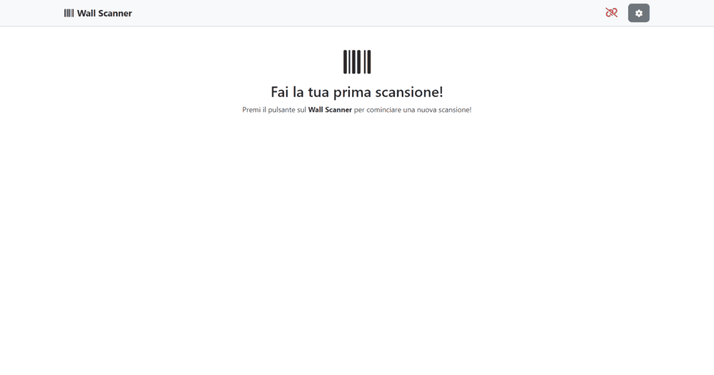
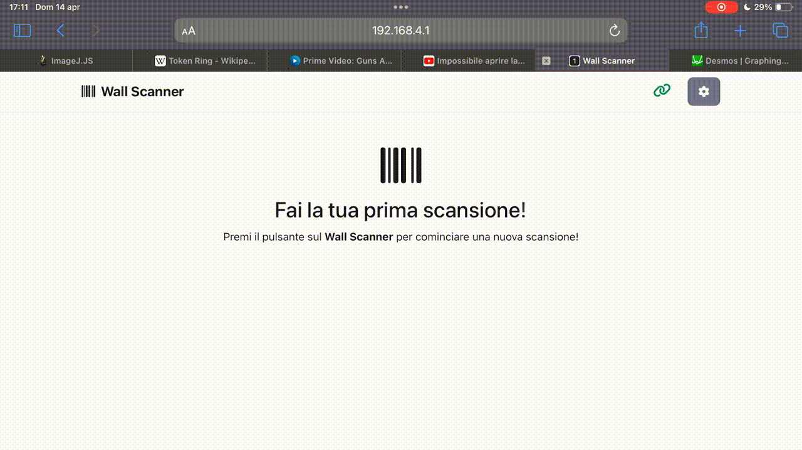
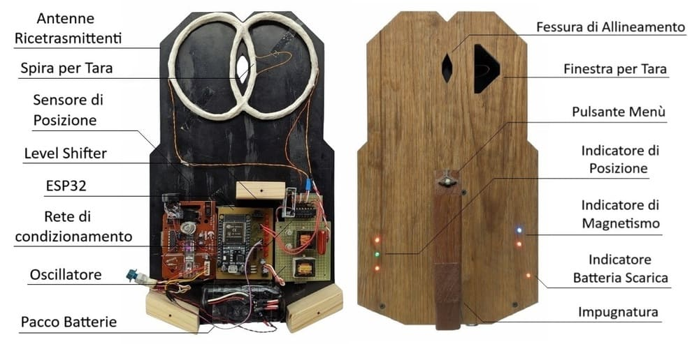
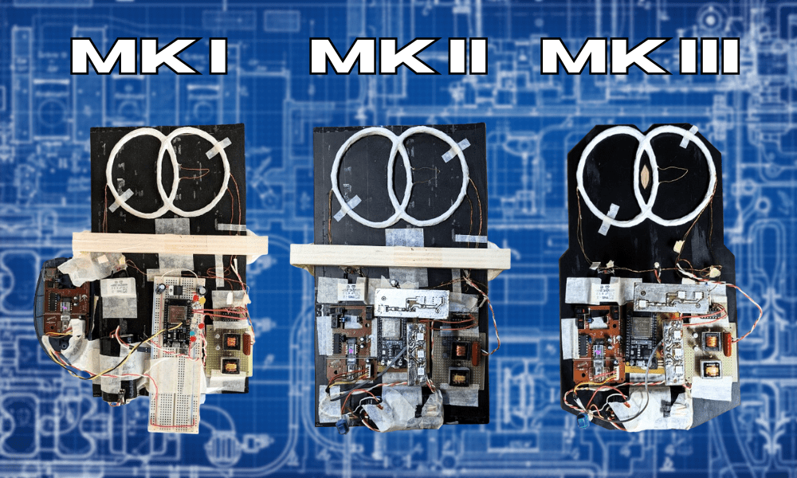

# 📡 Wall-Scanner - Portable Metal Detector in Walls

---

## 🎯 What is Wall-Scanner?

Wall-Scanner is a portable device based on ESP32 designed to map the presence of metallic elements inside walls and surfaces, displaying a real-time heatmap via a web interface accessible from smartphone or PC 🌐📱🔍.

### 🌟 Key Points

- 🧲 **Metal detection**: Identifies pipes, rebars and small metallic structures in walls
- 📡 **Wi-Fi connectivity**: Real-time updates via WebSocket for live heatmap visualization
- 🔋 **Portable design**: Battery-powered device, lightweight with intuitive web interface
- 🎯 **Material discrimination**: Approximate differentiation between ferromagnetic and non-ferromagnetic metals through color coding
- 📊 **Electromagnetic imaging**: Generates real-time electromagnetic maps of scanned surfaces
- 📱 **Multi-platform access**: Compatible with smartphones, tablets and PCs
- ⚡ **Easy calibration**: Simple configuration and scanning process for non-technical users

---

## 📸 Interface and Photos

Screenshots and demo of the web UI and prototype:

### 📱 Main Web Interface

### ⚙️ Available Settings

### 📦 Final Product

### 🔄 Prototype Evolution

### 🔍 Scan Example

---

## 🛠️ The Project in Detail

This project presents the development of an **innovative device 🆕 for detecting metallic structures 🧲 inside building walls**. The device allows scanning the area of interest and obtaining an **electromagnetic image 📊** of the wall, highlighting the presence and position of any **metallic elements 🔍**.

The prototype was designed and built entirely 🔧, and is able to connect via **Wi-Fi 📡** to external devices such as **smartphone 📱** or **laptop 💻**. While the device is moved over the area of interest, a real-time scan image is created ⏱️. The device is **portable 🔋** and **lightweight ⚖️**, powered by an **internal battery pack 🔋**, and does not require external wires 🔌. It has a **very simple 😊** and intuitive interface to use, even for non-technical personnel 👷‍♂️, and is compatible with any device capable of displaying a web page 🌐.

The device is designed to trace **iron plumbing pipes 🔩**, **copper pipes 🟫** for refrigerants, **reinforced concrete rebars 🏗️** and **other metallic structures** of modest size 📏. It is able to discriminate between **ferromagnetic 🧲** and **non-ferromagnetic 🔩** metals, using different colors for more intuitive visualization 🎨.

This makes it extremely useful for tracing the presence of **pipes 🔧** to install **nails 📌**, **support pins 🛠️**, **load-bearing structures 🏗️** and **hooks 🪝**, both for personal use 🏠 and for private clientele 🏢. It can also be used by professionals 👨‍🔧 to detect undocumented installations 📋, get a clear idea of the route of old **copper heating pipes** 🟫, or plan new electrical lines ⚡ in **renovations 🏠**.

During the project development, progress and successes were documented 📝 and are summarized in this repository 🗂️.

---

## Technologies 💡

### 🏗️ Project Architecture

Wall-Scanner consists of two main parts:

- 📡 The firmware on the ESP32 (which manages coil, time readings, PS2 mouse for tracking and a static web server with WebSocket)
- 🌐 The web‑UI (in the `data` folder) that receives data via WebSocket and shows the heatmap in real time

The device performs an initial tare, acquires measurements during scanning while moving on the wall and sends the data to the connected client for visualization 🔁.

### 💡 Technologies and Libraries

Here is a list of technologies used in this project:

#### Frontend

- 🌐 HTML/CSS/JavaScript
- 🎨 Bootstrap (UI)
- 🔗 WebSocket (real-time communication)

#### Device/Firmware

- 📡 ESP32
- 💾 LittleFS (Filesystem for the web UI)
- 🖱️ PS2MouseHandler (Movement tracking)
- 🌐 ESPAsyncWebServer/AsyncWebSocket

---

## 📋 Installation Instructions

### 🔧 Prerequisites

- 🛠️ PlatformIO (or compatible Arduino environment)
- 📡 ESP32
- 💾 Tool to upload the filesystem (PlatformIO: Build Filesystem Image, Upload Filesystem Image)

### 📦 Installation

To set up the Wall-Scanner you can follow these steps:
1. 🔌 Connect all necessary hardware to the ESP32.
2. 📥 Download the source code from the repository.
3. ⚙️ Verify that the ESP pinout is correct. If necessary, modify the pin values to adapt them to your configuration.
4. 🔗 Connect the ESP to the PC via USB.
5. 💾 Use PlatformIO to write the `data` folder to the ESP flash memory (`Build Filesystem Image`, then `Upload Filesystem Image`).
6. 🚀 Use PlatformIO to upload the source code to the ESP.
7. 🎉 Enjoy the Wall-Scanner! ❤️

---

## ✅ Main Features

- ⚙️ Automatic coil calibration
- 🖱️ Position acquisition via PS2 mouse (tracking)
- 📊 Generation of a real-time heatmap sent via WebSocket
- 💾 Temporary saving of scan data in a CSV string for download/analysis
- 🔊 Signaling via LED and beeper for status, errors and confirmations

---

## 📋 Important Notes

- ⚙️ The device performs an initial tare phase (Fi0) before scanning.
- 🔄 During scanning, move the device over the entire area of interest; the scan resolution is configurable (variable `NCM` in preferences).
- 📁 The `data` folder contains the web UI: modifications and improvements to the UI can be made there and reloaded with Upload Filesystem Image.

---

## 📄 License

This project is distributed under the **MIT License** - see the [LICENSE](LICENSE) file for details.

---

## 🙏 Acknowledgments

- 🎨 **Bootstrap** for support in styling the web interface
- 📊 **Visualization libraries** (for example charting and JS utilities) that make heatmap and metrics visualization possible
- 🤖 **Authors of open-source libraries** used in the firmware: `ESPAsyncWebServer`, `AsyncWebSocket`, `PS2MouseHandler`, `LittleFS` and others