

# 📡 Wall-Scanner - Portable Metal Detector in Walls

---

## 🎯 What is Wall-Scanner?

Wall-Scanner is a portable device based on ESP32 designed to map the presence of metallic elements inside walls and surfaces, displaying a real-time heatmap via a web interface accessible from smartphone or PC 🌐📱🔍.

### 🌟 Key Points

- 🧲 **Metal detection**: Identifies pipes, rebars and small metallic structures in walls
- 📡 **Wi-Fi connectivity**: Real-time updates via WebSocket for live heatmap visualization
- 🔋 **Portable design**: Battery-powered device, lightweight with intuitive web interface
- 🎯 **Material discrimination**: Approximate differentiation between ferromagnetic and non-ferromagnetic metals through color coding
- 📊 **Electromagnetic imaging**: Generates real-time electromagnetic maps of scanned surfaces
- 📱 **Multi-platform access**: Compatible with smartphones, tablets and PCs
- ⚡ **Easy calibration**: Simple configuration and scanning process for non-technical users

---

## 📸 Interface and Photos

Screenshots and demo of the web UI and prototype:

### 📱 Main Web Interface
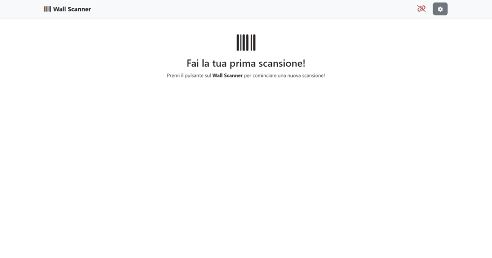

### ⚙️ Available Settings
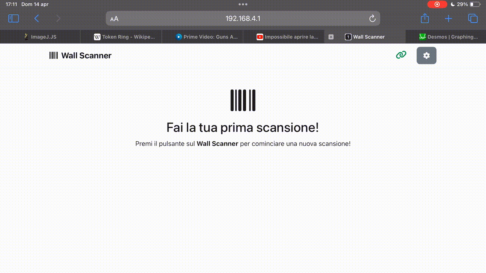

### 📦 Final Product
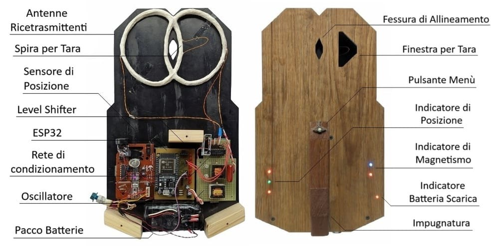

### 🔄 Prototype Evolution
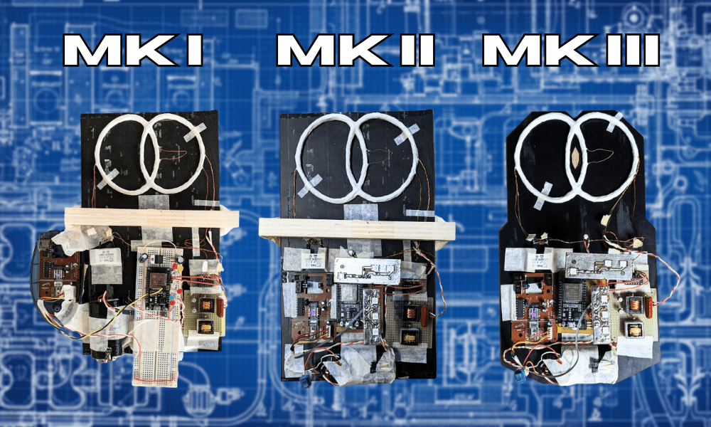

### 🔍 Scan Example

### 🎥 Startup Sequence
<video src="./docs/pushbutton-wall-scanner.mp4" controls width="100%" height="400"></video>

---

## 🛠️ The Project in Detail

This project presents the development of an **innovative device 🆕 for detecting metallic structures 🧲 inside building walls**. The device allows scanning the area of interest and obtaining an **electromagnetic image 📊** of the wall, highlighting the presence and position of any **metallic elements 🔍**.

The prototype was designed and built entirely 🔧, and is able to connect via **Wi-Fi 📡** to external devices such as **smartphone 📱** or **laptop 💻**. While the device is moved over the area of interest, a real-time scan image is created ⏱️. The device is **portable 🔋** and **lightweight ⚖️**, powered by an **internal battery pack 🔋**, and does not require external wires 🔌. It has a **very simple 😊** and intuitive interface to use, even for non-technical personnel 👷‍♂️, and is compatible with any device capable of displaying a web page 🌐.

The device is designed to trace **iron plumbing pipes 🔩**, **copper pipes 🟫** for refrigerants, **reinforced concrete rebars 🏗️** and **other metallic structures** of modest size 📏. It is able to discriminate between **ferromagnetic 🧲** and **non-ferromagnetic 🔩** metals, using different colors for more intuitive visualization 🎨.

This makes it extremely useful for tracing the presence of **pipes 🔧** to install **nails 📌**, **support pins 🛠️**, **load-bearing structures 🏗️** and **hooks 🪝**, both for personal use 🏠 and for private clientele 🏢. It can also be used by professionals 👨‍🔧 to detect undocumented installations 📋, get a clear idea of the route of old **copper heating pipes** 🟫, or plan new electrical lines ⚡ in **renovations 🏠**.

During the project development, progress and successes were documented 📝 and are summarized in this repository 🗂️.

---

## Technologies 💡

### 🏗️ Project Architecture

Wall-Scanner consists of two main parts:

- 📡 The firmware on the ESP32 (which manages coil, time readings, PS2 mouse for tracking and a static web server with WebSocket)
- 🌐 The web UI (in the `data` folder) that receives data via WebSocket and shows the heatmap in real time

The device performs an initial tare, acquires measurements during scanning while moving on the wall and sends the data to the connected client for visualization 🔁.

### 💡 Technologies and Libraries

Here is a list of technologies used in this project:

#### 🎨 Frontend

- 🌐 HTML/CSS/JavaScript
- 🎨 Bootstrap (UI)
- 🔗 WebSocket (real-time communication)

#### 🔧 Device/Firmware

- 📡 ESP32
- 💾 LittleFS (Filesystem for the web UI)
- 🖱️ PS2MouseHandler (Movement tracking)
- 🌐 ESPAsyncWebServer/AsyncWebSocket

---

## 🔌 Hardware

The Wall-Scanner hardware has been divided into several essential functional blocks that work together to acquire data, process it, and make it available to the user in real-time. Below is a detailed analysis of each individual component and its role within the system.

### 🧲 The Electromagnetic Sensor (Metal Sensor)
The core of the detection exploits the principle of signal cancellation through a "Double D" antenna configuration. The system is composed of a transmitting antenna (TX) of 35 turns and a receiving antenna (RX) of 30 turns, partially overlapping. In the absence of metals, the specific geometric overlap ensures that the induced currents in the receiving coil cancel each other out almost perfectly. When a metallic object enters the operating range, it deforms the magnetic lines of force created, unbalancing the system and inducing a measurable signal in the RX antenna. This unbalance and the relative phase shift allow not only the detection of the metal but also the discrimination between ferromagnetic and non-ferromagnetic materials.

The TX antenna is driven by a **two-transistor resonant RLC oscillator**. This specific topology was chosen because, by exploiting the resonance of a slightly damped LC circuit and a custom-wound transformer with a ferrite core, it is able to generate a very stable sine wave at about 18kHz with an amplitude of 35Vpp. This voltage, much higher than the supply voltage, guarantees a magnetic field intense enough to detect metals up to 30 cm deep.

### 📐 Oscillator schematic

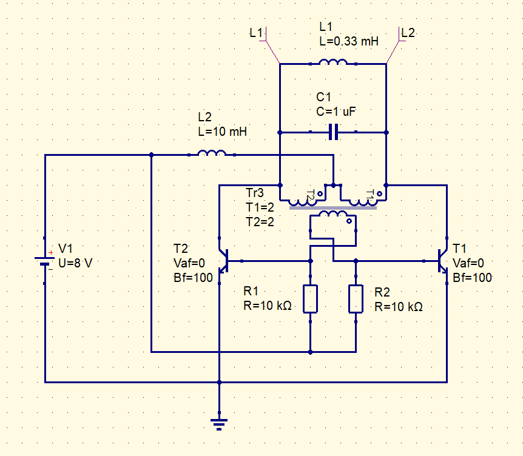

The circuit was simulated with QUCS software (now uSimmics) and finally built and tested with an oscilloscope.

### 🧪 Start-Up Simulation

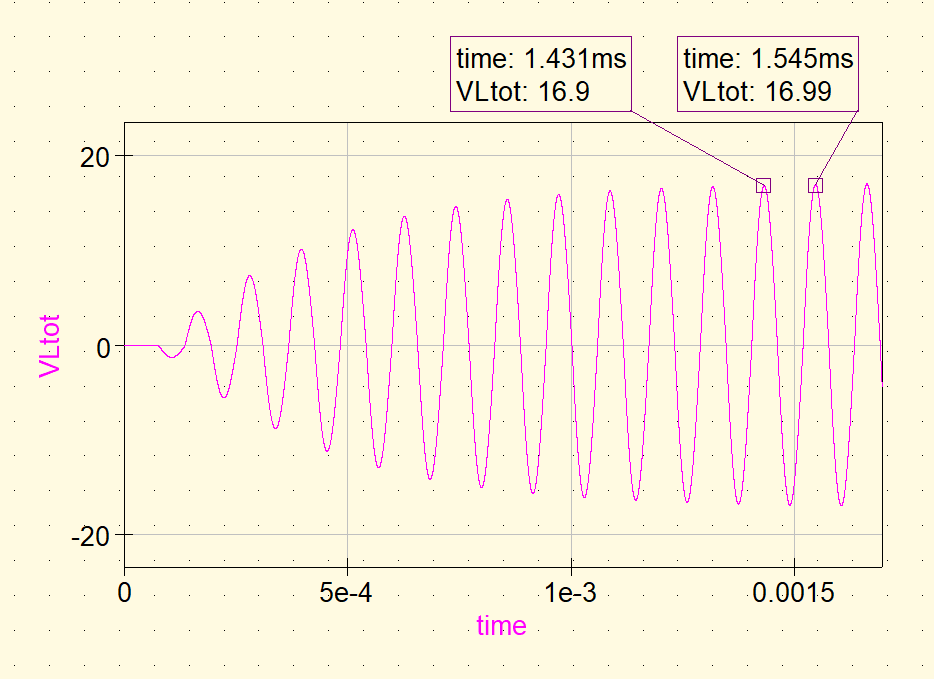

### 📊 Start-Up Measurement

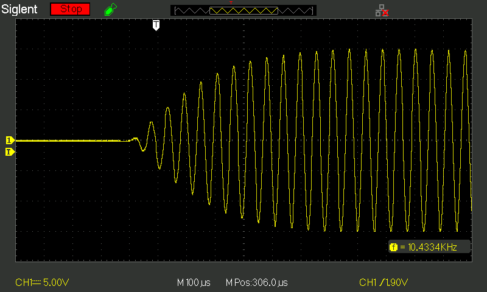

The signal collected by the RX antenna, whose amplitude varies based on the proximity of the metal, must be processed to be read digitally. Since the microcontroller measures the phase shift by triggering interrupt functions, the sinusoidal signal is transformed into a square wave through a **conditioning network**. For this stage, a comparator circuit was implemented using the LM339 integrated circuit. Compared to other standard operational amplifiers (like the LM358), the LM339 has a much higher slew rate (10 V/µs), guaranteeing sharp and immediate rising and falling edges, which are essential for an accurate temporal calculation by the microcontroller.

### 🔧 Conditioning Network

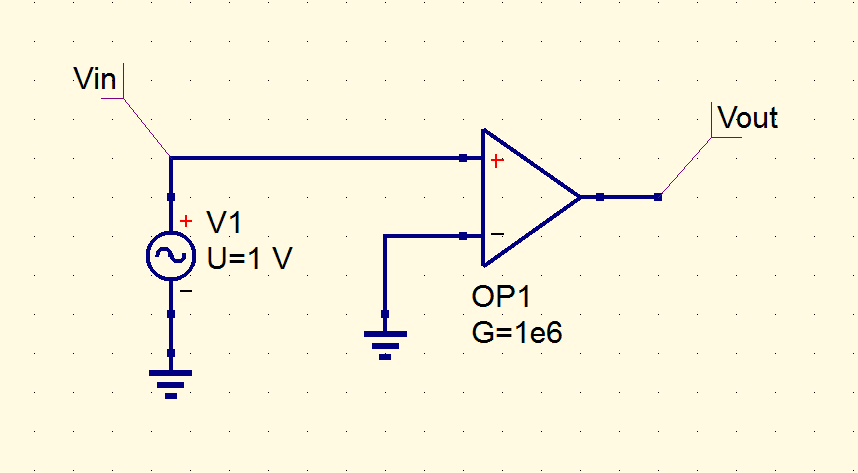

### 📉 Thresholded Signal

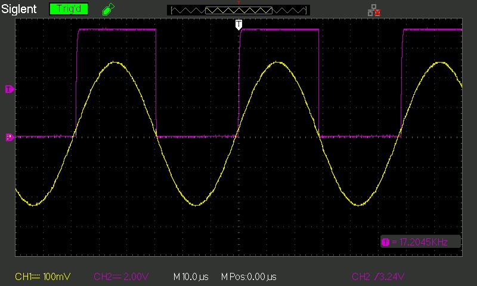

### 🖱️ The Positioning System
To correlate the measured magnetic intensity to the physical coordinates on the wall, the device uses an **optical sensor** (ADNS-2610 chip) recovered from a PS/2 mouse. Compared to a purely mechanical system (like an encoder or a rail structure), the optical sensor guarantees a fluid reading of bidirectional movements (X and Y axes) by capturing 4000 frames per second of the wall surface, all while keeping the device portable and compact. 

Since the optical sensor and its PS/2 protocol natively operate with 5V logic levels, while the ESP32 microcontroller accepts a maximum of 3.3V as input, a specific **level shifter circuit** was designed. Using the natural voltage drop provided by a series of colored LEDs (specifically, two red LEDs coupled with a current-limiting resistor), the circuit reliably adapts the incoming Clock and Data signals, reducing the 5V to about 3.2V, a perfect value for the ESP32 logic. The same **level shifter circuit** was used to adapt the LM339 output voltage to logic level signals.

### ⚡ Level Shifter Circuit

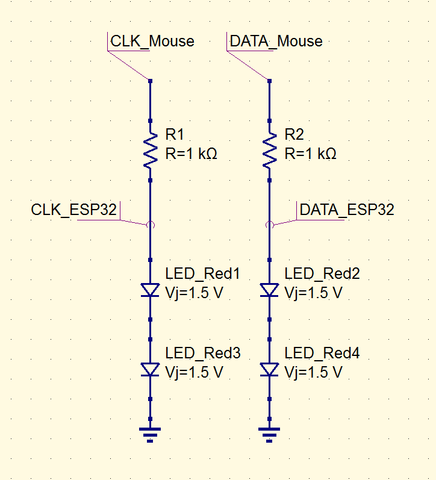

### 📊 Level Shifter Measurement

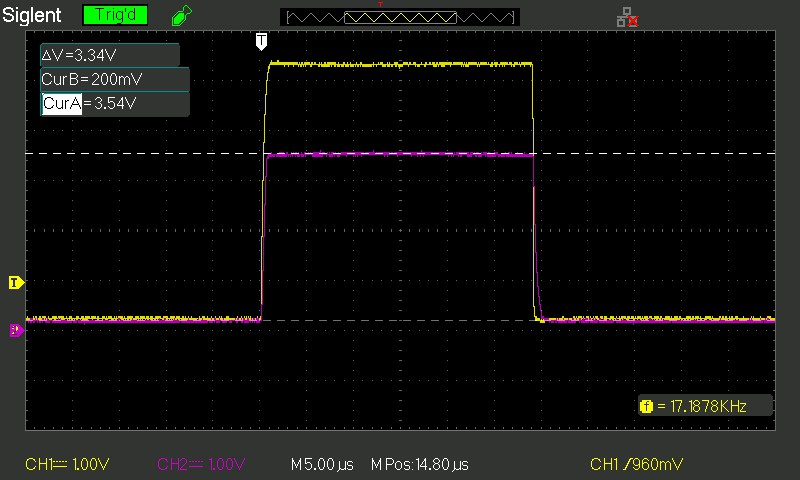

### 🧠 The Microcontroller
The control architecture is based on the powerful **ESP32 DevKit V1**. The strict timing specifications required by the scan (high clock frequencies to resolve the minimal phase variations between the two antennas) dictated the use of a fast processor. The ESP32, with its 240MHz clock, dual-core CPU, and wide availability of hardware interrupts, proved perfect for handling the simultaneous sampling of the sensors without bottlenecks. In addition to the high computing power, the native inclusion of the 802.11 Wi-Fi module is fundamental, as it allows the chip to act as a web server and transmit the generated heatmap directly to the client (PC or smartphone) in real-time.

### 🔋 The Power Supply
The device is completely portable and free of external cables, powered by an internal battery pack. This is composed of **two 18650 lithium-ion cells** connected in series, capable of providing a total nominal voltage between 7V and 8.4V. With a peak consumption calculated at around 450mA, the batteries guarantee a comfortable autonomy of over 5 hours (about 22Wh of capacity).

The energy is distributed based on the needs of the various blocks:
- The raw battery voltage (7-8.4V) **directly powers the oscillator**, maximizing efficiency without dispersions and allowing the oscillator to generate high voltage peaks.
- A **7805** linear voltage regulator provides a stable and clean **5V** line, used for the operation of the PS/2 optical sensor.
- A downstream **AMS1117-3.3** regulator further lowers the voltage to the **3.3V** required by the ESP32. Powering the AMS1117 via the 5V output (instead of directly from the battery) drastically limits the heat to be dissipated, increasing the reliability of the microcontroller.

### 🏗️ The External Structure
Finally, every electronic component is housed in a resistant **custom protective enclosure**, designed for use in construction sites and dusty environments. The front and back structure is composed of rigid anti-scratch plastic panels, topped by a solid handle hand-carved in teak wood. 

In the development of the internal layout, extreme attention was paid to the arrangement of metallic loads. Since the Double D coil technology is hyper-sensitive to surrounding metals, the critical functional blocks (such as the batteries and the motherboard) were fixed in such a way as to maintain a clearance of at least 7-8 cm from the electromagnetic sensor, preventing accidental saturation. 

Interaction with the user takes place via front indicator panels, for which custom PCBs hosting **RGB LEDs** were acid-etched. Furthermore, a specific framework equipped with a spring mechanism ensures that the optical sensor on the back is always actively pushed against the wall with constant pressure, guaranteeing flawless reading of the coordinates even in the presence of rough or slightly irregular walls.

---

## 📋 Installation Instructions

### 🔧 Prerequisites

- 🛠️ PlatformIO (or compatible Arduino environment)
- 📡 ESP32
- 💾 Tool to upload the filesystem (PlatformIO: Build Filesystem Image, Upload Filesystem Image)

### 📦 Installation

To set up the Wall-Scanner you can follow these steps:
1. 🔌 Connect all necessary hardware to the ESP32.
2. 📥 Download the source code from the repository.
3. ⚙️ Verify that the ESP pinout is correct. If necessary, modify the pin values to adapt them to your configuration.
4. 🔗 Connect the ESP to the PC via USB.
5. 💾 Use PlatformIO to write the `data` folder to the ESP flash memory (`Build Filesystem Image`, then `Upload Filesystem Image`).
6. 🚀 Use PlatformIO to upload the source code to the ESP.
7. 🎉 Enjoy the Wall-Scanner! ❤️

---

## ✅ Main Features

- ⚙️ Automatic coil calibration
- 🖱️ Position acquisition via PS2 mouse (tracking)
- 📊 Generation of a real-time heatmap sent via WebSocket
- 💾 Temporary saving of scan data in a CSV string for download/analysis
- 🔊 Signaling via LED and beeper for status, errors and confirmations

---

## 📋 Important Notes

- ⚙️ The device performs an initial tare phase (Fi0) before scanning.
- 🔄 During scanning, move the device over the entire area of interest; the scan resolution is configurable (variable `NCM` in preferences).
- 📁 The `data` folder contains the web UI: modifications and improvements to the UI can be made there and reloaded with Upload Filesystem Image.

---

## 📄 License

This project is distributed under the **MIT License** - see the [LICENSE](LICENSE) file for details.

---

## 🙏 Acknowledgments

- 🎨 **Bootstrap** for support in styling the web interface
- 📊 **Visualization libraries** (for example charting and JS utilities) that make heatmap and metrics visualization possible
- 🤖 **Authors of open-source libraries** used in the firmware: `ESPAsyncWebServer`, `AsyncWebSocket`, `PS2MouseHandler`, `LittleFS` and others